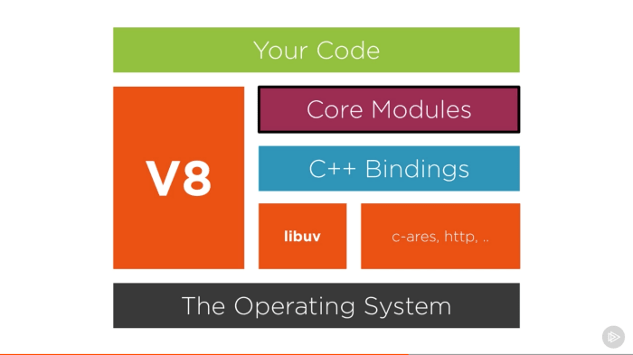

### Máquina virtual do Node

O NodeJS é composto por:

- Motor V8 (engine para executar o código JS. É escrito 70% em C++ e 30% em JS)
- Binding (libs que permitem a ligação entre duas entidades diferentes, nesse caso entre o Node e o C/C++)
- Libuv (escrita em C)
- http-parser
- c-ares
- OpenSSL
- zlib

A imagem abaixo exemplifica isso

### Funcionamento Node

No ecossistema do Node nós temos a linguagem JavaScript sendo usada para codificação. A partir da chamada de funções JavaScript, temos Bindings do Node que basicamente fazem uma ligação do código JS com o código C++. Esses Bindings fazem parte da V8.

### Engine JavaScript

Uma Engine JavaScript é uma software capaz de executar e interpretar código JavaScript.

Esse mecanismo consiste principalmente em dois componentes:

- O heap de memória: onde toda a alocação de memória acontece
- A pilha de chamadas (ou call stack): onde nosso código é colocado em frames e empilhado para ser executado

### Execução single-threading

A existência de uma única thread pode ser muito vantajosa pois não precisamos nos preocupar com deadlocks e racing conditions, condições especificas de multithread.

No entanto,  o uso de uma única thread pode ser limitadora, devido ao fato de existir apenas uma call stack, podendo essa ser bloqueada por algum código que demore muito.

### Libuv

O Libuv é uma biblioteca open source que lida com a thread-pool, sinalização e comunicação entre processos, e toda a mágica necessária para fazer com que as tarefas assíncronas funcionem.

A maioria das pessoas pensa que o libuv é o event loop em si, isso não é verdade, o libuv implementa um event loop com todos os recursos, mas também é a casa de várias outras partes principais do Node, como:

Sockets TCP e UDP do pacote net
Resoluções DNS assíncronas
Operações assíncronas de arquivos e file system
Eventos do file system
IPC
Child processes e controle de shell
Controle de threads
Sinalização
Relógio de alta resolução

É principalmente por isso que o Node.js usa esta biblioteca, ela é uma abstração completa em torno de várias partes principais de todos os sistemas operacionais e é necessário que todo o runtime interaja com o ambiente que há ao redor dele.

### Callbacks Assincronos

 Os callbacks são, desde o início da programação, uma função chamada automaticamente que é passada como parâmetro para outra função que será executada e/ou terá seu valor retornado após "agora". Portanto, basicamente, callbacks são uma maneira de dizer: "Ei, quando você tiver esse valor, chame essa função aqui". Então, vamos melhorar nosso exemplo:

 